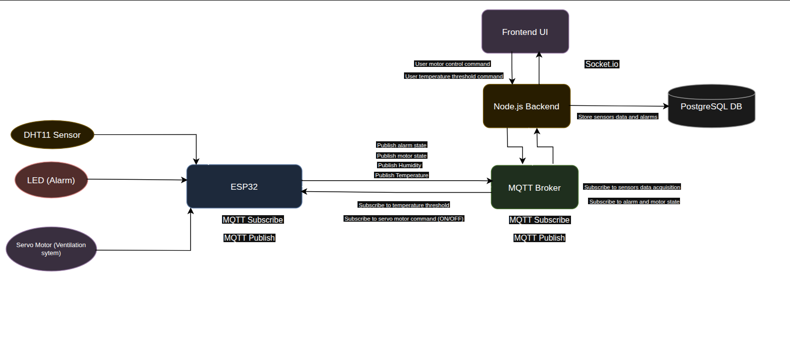

# Internet_Of_Things_Full_Stack_UFMG
# 🌡️ ESP32 IoT Monitoring & Control System

This project implements a complete IoT solution using the **ESP32 microcontroller** to monitor environmental data (temperature and humidity) and control actuators (LED for alarm and Servo Motor for ventilation). The system communicates using **MQTT**, processes data in a **Node.js backend**, displays real-time updates on a **frontend UI**, and stores sensor data in a **PostgreSQL database**.

---

## 📊 System Architecture

<!-- Replace this line with your diagram -->

---

## 📦 Components

### 🧠 ESP32 (Firmware)
- **Sensors**: DHT11 for temperature and humidity.
- **Actuators**: 
  - LED for over-temperature alarms.
  - Servo motor for ventilation control.
- **MQTT Communication**:
  - **Publishes**: `temperature`, `humidity`, `motor state`, `alarm state`
  - **Subscribes**: `temperature threshold`, `servo command (ON/OFF)`

### 🧩 MQTT Broker
- Routes all messages between ESP32 and backend.
- Commonly used brokers: [Mosquitto](https://mosquitto.org/), HiveMQ, EMQX.

### 🖥️ Node.js Backend
- Subscribes to MQTT sensor data.
- Stores data and alarms in **PostgreSQL**.
- Publishes control messages (e.g., threshold updates, servo commands).
- Communicates with frontend using **Socket.io** for real-time updates.

### 💾 PostgreSQL Database
- Stores:
  - Sensor readings (temperature, humidity)
  - Alarm triggers and actuator events

### 🌐 Frontend UI (React + Tailwind CSS)
- Real-time display of sensor data and system state.
- Built with **React** and styled using **Tailwind CSS**
- Allows user to:
  - Set temperature threshold
  - Manually control the ventilation motor

---

sudo systemctl start mosquitto
